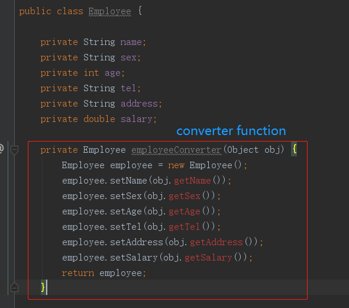

# Bean Converter
This is an IDEA Plugin using to generate bean converter function by another object. 

### Step1

Open your bean file and press `alt+insert`, click item `Bean Converter`

### Step2

Then you can see converter function,and replace parameter `obj` with your own parameter.

